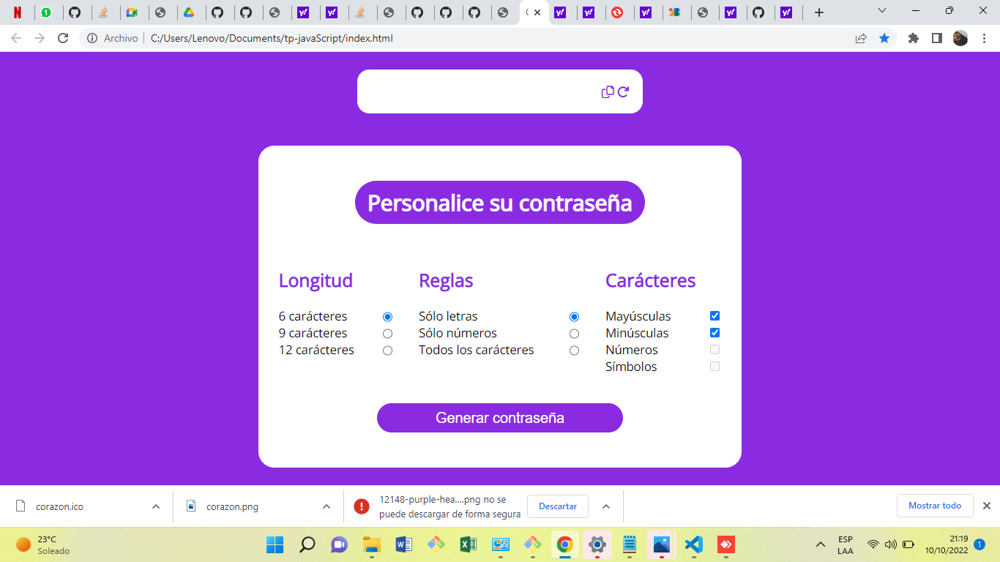

# Mi Generador de Contraseñas💗
## Por María Macarena Álvarez Castillo.

Para crear éste repositorio puse en práctica todo lo aprendido en el **primer modulo** del curso de **Frontend** de **Ada ITW**.                

Para realizar éste proyecto utilicé principalmente **JavaScript** pero también **HTML5 Y CSS3**.

Se trata de un programa, que a través de condiciones seleccionadas por el usuario, genera claves de forma aleatoria.
Para ello creé funciones, utilicé eventos e interctué con el DOM.

---
### Espero les guste mi trabajo💜💻

 

Finalmente [Acá está mi deployado](https://macaac.github.io/tp_javaScript/)😍⌨️ 
